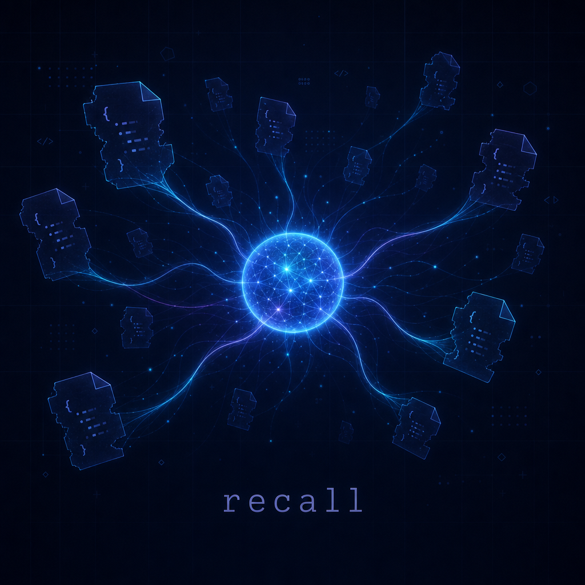

# recall



> **흐릿한 한 마디면, 과거 Claude Code / Codex 세션이 되살아난다.**
> 사람이 콘솔에서 직접 치는 도구가 아니라, **Claude Code / Codex 안에서 AI 가 자동으로 호출하는 skill** 입니다.

[English README](README.en.md)

---

## 어떻게 쓰는가

세션을 한 번도 rename 하거나 fork 해둔 적이 없어도 — 흐릿한 주제 한 줄이면 됩니다. **Claude Code 또는 Codex 안에서** 자연어로 말하세요.

```
You: 그때 deno 인증 헤더 작업했던 거 다시 시작해줘.

AI:  recall 로 찾아볼게요.
     ➜ recall search "deno 인증 헤더"
     매칭 2건:
       • claude / 3cca0676 / "deno 웹소켓 인증 통합"      / 2026-05-20
       • codex  / 019e3891 / "...Deno WS 인증 헤더 작업"  / 2026-05-18
     더 최근의 claude 세션을 resume 합니다.
     ➜ recall resume 3cca0676

[그 세션이 원래 cwd 에서 그대로 살아남]
```

`recall` 명령 자체를 사람이 외울 필요 없습니다. **AI 가 SKILL.md 를 읽고 알아서 호출**합니다.

---

## 왜

`claude --resume` 도 `codex resume` 도 picker 를 띄워주지만, 세션이 수십·수백 개 쌓이면 picker 가 무엇을 하던 세션인지 알려주지 않습니다. **rename 한 적 없고, fork 해둔 적 없습니다. 기억나는 건 흐릿한 주제 한 줄뿐.** 그 한 줄을 AI 가 받아서 `recall` 로 정확히 찾아냅니다.

- **로컬 전용.** 세션은 외부로 나가지 않습니다. 클라우드 동기화 없음, 텔레메트리 없음.
- **두 도구 통합.** Claude Code (`~/.claude/projects/`) + Codex (`~/.codex/history.jsonl`) 한 곳에 인덱스.
- **FTS5 풀텍스트 + 선택적 임베딩.** SQLite 만으로 키워드 매칭 OK, 더 흐릿하면 본인 API key 로 의미검색.
- **원클릭 resume.** AI 가 매칭된 세션을 `claude --resume` / `codex resume` 로 원래 cwd 에서 자동 재개.
- **AI 가 사용하는 도구.** SKILL.md 는 한국어/영어 트리거 표현이 박혀있어 자연어 요청에 자동 반응.

---

## 설치 — AI 에게 한 줄로 맡기기 (권장)

이미 Claude Code 또는 Codex 가 깔려있고 OAuth 인증된 상태라면, 그 도구에게 그대로 붙여넣으세요. 의존성 · 빌드 · PATH 등록 · **SKILL.md skill 등록** · 첫 인덱싱까지 알아서 처리합니다.

### Claude Code 에게

`claude` 안에서 그대로 붙여넣기:

```
https://github.com/Hostingglobal-Tech/recall 를 이 머신에 설치해줘.

1. Rust 가 없으면 rustup 으로 설치.
2. 저장소를 ~/.local/share/recall 에 clone 하고 cargo build --release.
3. 빌드 산출물(target/release/recall)을 PATH 의 적절한 디렉토리(예: ~/.local/bin)에 복사.
4. plugins/claude/SKILL.md 를 ~/.claude/skills/recall/SKILL.md 로 복사 (Skill 등록).
5. `recall init && recall scan` 실행.

각 단계 결과 확인하면서 진행해줘.
```

### Codex 에게

쉘 한 줄:

```bash
codex "Install https://github.com/Hostingglobal-Tech/recall on this machine.\
 1) install rustup if missing,\
 2) clone to ~/.local/share/recall and cargo build --release,\
 3) copy the binary into ~/.local/bin (or any PATH dir),\
 4) copy plugins/claude/SKILL.md to ~/.claude/skills/recall/SKILL.md so other AI agents can use it as a skill,\
 5) finally run 'recall init && recall scan'.\
 Confirm each step."
```

설치가 끝나면 **명령을 외울 필요 없이** 그냥 자연어로 말하면 됩니다:

```
> 어제 oauth 연결하던 그 작업 다시 시작.
> 그때 supabase RLS 정책 짰던 그 세션 어디였지?
> 지난주에 K8s 인그레스 디버깅했던 거 이어서.
```

---

## 설치 — 손으로 직접 (선택)

Rust 1.74+ 필요.

```bash
git clone https://github.com/Hostingglobal-Tech/recall.git ~/.local/share/recall
cd ~/.local/share/recall
cargo build --release
cp target/release/recall ~/.local/bin/

# Claude Code skill 등록
mkdir -p ~/.claude/skills/recall
cp plugins/claude/SKILL.md ~/.claude/skills/recall/SKILL.md

# 첫 인덱싱
recall init
recall scan
```

---

## AI 가 부르는 명령 (참고)

사람은 보통 외울 필요 없습니다. AI 가 SKILL.md 안내대로 호출합니다.

| 명령 | 동작 |
|---|---|
| `recall init` | `~/.recall/recall.db` 생성 (idempotent) |
| `recall scan [--provider claude\|codex\|all] [--force]` | 로컬 세션 파일 인덱싱. sha256 변경분만 upsert. |
| `recall search "<키워드>"` | title / first_prompt / last_prompt / body 풀텍스트 FTS5 검색 |
| `recall semantic "<키워드>"` | 임베딩 cosine top-K (API key 필요) |
| `recall show <session_id_prefix>` | 세션 상세 (메타 + first/last prompt) |
| `recall resume <id\|키워드>` | `claude --resume` 또는 `codex resume` 자동 분기 + 원래 cwd 실행 |
| `recall related <session_id_prefix>` | 같은 cwd 의 다른 세션 (1-hop 그래프) |
| `recall embed [--provider all] [--force]` | 임베딩 생성 (API key 필요) |
| `recall stats` | provider 별 세션/메시지/사이즈 통계 |

---

## 선택: 의미 검색 (semantic)

`recall search` (FTS5) 는 키워드 매칭. "비슷한 의미" 까지 잡으려면 임베딩.

1. OpenAI API key 발급 (https://platform.openai.com/api-keys)
2. 환경변수: `export OPENAI_API_KEY=sk-...`
3. `~/.recall/config.toml`:
   ```toml
   [embedding]
   provider    = "openai"
   model       = "text-embedding-3-small"
   api_key_env = "OPENAI_API_KEY"
   ```
4. `scan` 후 한 번 `embed`:
   ```bash
   recall embed
   ```

이후 AI 가 의미검색 fallback 으로 자동 사용 (SKILL.md 가 안내).

다른 provider (Voyage / Cohere / 로컬 Ollama) 는 `src/main.rs` 의 `embed_text` 에 분기 추가 (~10줄).

---

## 데이터 위치

```
~/.recall/
├── recall.db          # SQLite (sessions, sessions_fts, embeddings, edges)
└── config.toml        # 선택 — 임베딩 쓸 때만
```

스키마 요약:

```sql
sessions       (id, provider, session_id, cwd, title, first/last_prompt, ...)
sessions_fts   FTS5 가상 테이블 (title + prompts + body)
embeddings     (session_pk → f32 벡터 BLOB + model + dim)
edges          (src_pk, dst_pk, kind, weight)  -- 1-hop 그래프 (same_cwd, 향후 shared_entity)
```

---

## 프라이버시 & 안전

- **외부 전송 0** (본인이 임베딩 활성화한 경우의 OpenAI HTTPS 요청만 예외).
- **텔레메트리 0.**
- recall 은 `~/.claude/projects/`, `~/.codex/history.jsonl` 을 **읽기만** 하고 `~/.recall/` 에만 **씁니다**. 원본 세션 파일 안 건드림.
- `resume` 는 공식 `claude` / `codex` 바이너리를 그대로 exec — recall 자체는 세션 내용 안 바꿉니다.

---

## FAQ

**`claude` / `codex` 가 설치 안 돼있어도?** `search` / `show` 는 OK. `resume` 는 원본 CLI 가 PATH 에 있어야 동작.

**여러 머신 통합?** 의도적으로 안 합니다. 단일 노드 전용.

**오래된 jsonl 재 scan?** sha256 증분이라 변경 없는 파일은 skip.

**Cursor / Continue / Gemini / Aider 도?** PR 환영. 다만 단일 도구 집중이 picker 의 정직함을 유지합니다.

---

## 라이선스

MIT — [LICENSE](LICENSE)
